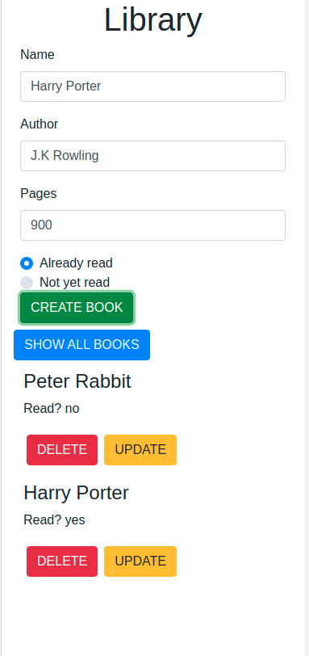

# library


> A CRUD app for storing and displaying books in a library using basic JavaScript data structures of Objects(their prototypes) and Arrays. 
Through dom scripting to manupulate various elements, a user is able to create and dynamically update the read status of a book.

It has the one main basic landing page. When all books is clicked, it shows all the books in the library with the option to update and delete. 

## Main Page

### Home Landing
| 

## Built With

- HTML5 & CSS3, & JavaScript
- Bootstrap

## Live Demo

[Live Demo Link](https://kabohajeanmark.github.io/library/)

## Instructions
To get a local copy up and running follow these simple example steps.

### Prerequisites
- Gitbash installed to navigate between the branches.
- A preferred text editor for example VS Code.
- A browser such as Google Chrome

### Install
Clone this [GitHub Repo](https://github.com/KabohaJeanMark/library/tree/ft-library) to your computer on yourFolder by typing these commands in the terminal or download as a Zip file and extract.
```
$ mkdir yourFolder
$ cd yourFolder
$ git clone https://github.com/KabohaJeanMark/library/
```

### Usage
- View with live Server in VS code or Right click and open the index.html in your browser to view.

## Author

👤 **Kaboha Jean Mark**

- GitHub: [@KabohaJeanMark](https://github.com/KabohaJeanMark)
- Twitter: [@jean_quintus](https://twitter.com/jean_quintus)
- LinkedIn: [Jean Mark Kaboha](https://www.linkedin.com/in/jean-mark-kaboha-software-engineer/)


## 🤝 Contributing

Contributions, issues, and feature requests are welcome!

Feel free to check the [issues page](https://github.com/KabohaJeanMark/library/issues).

## Show your support

Give a ⭐️ if you like this project!

## Acknowledgments

- Hat tip to Microverse for the README template, instructions and tutoring for this Capstone project.

## 📝 License

This project is [MIT](./LICENSE) licensed.